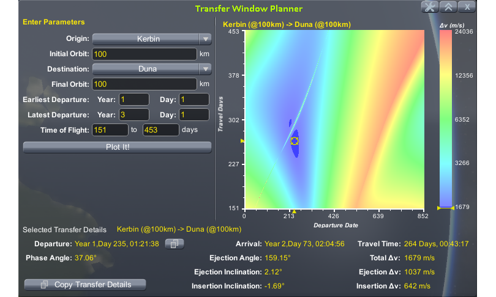
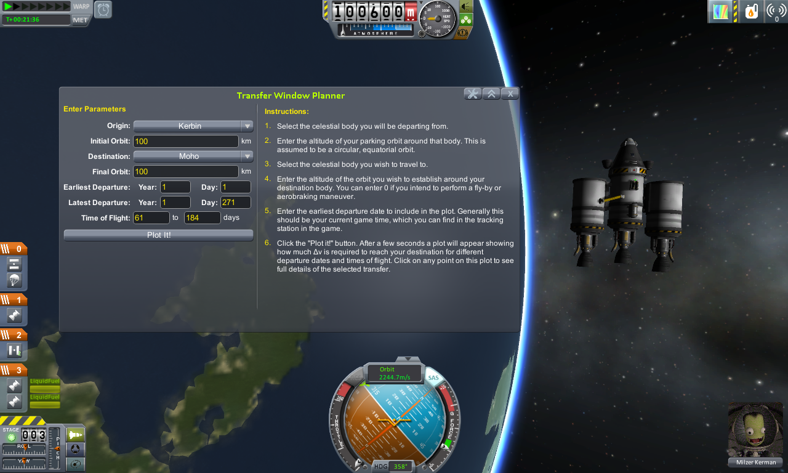
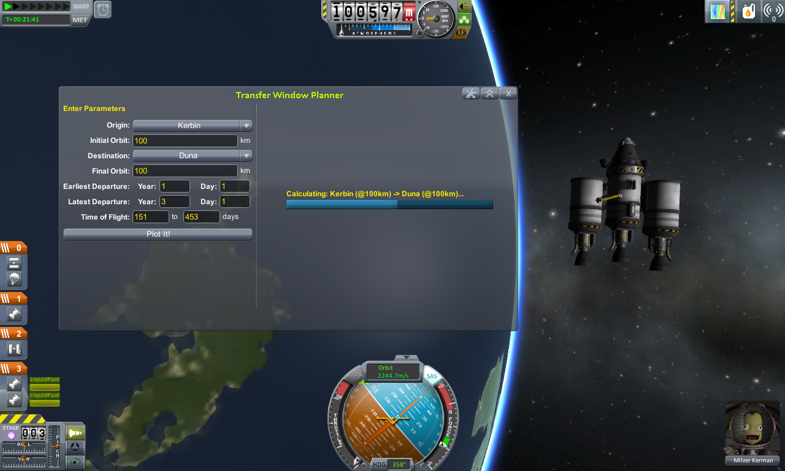
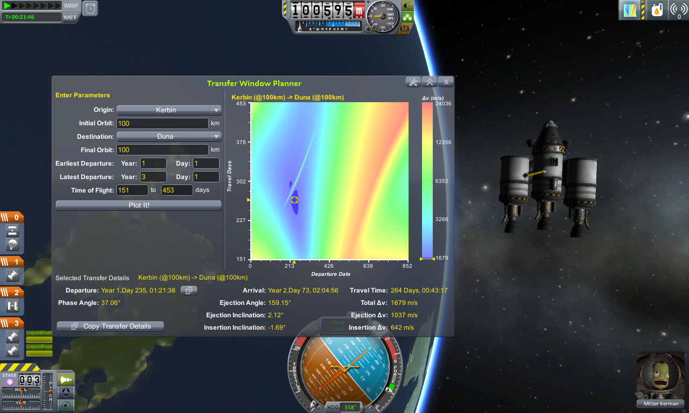
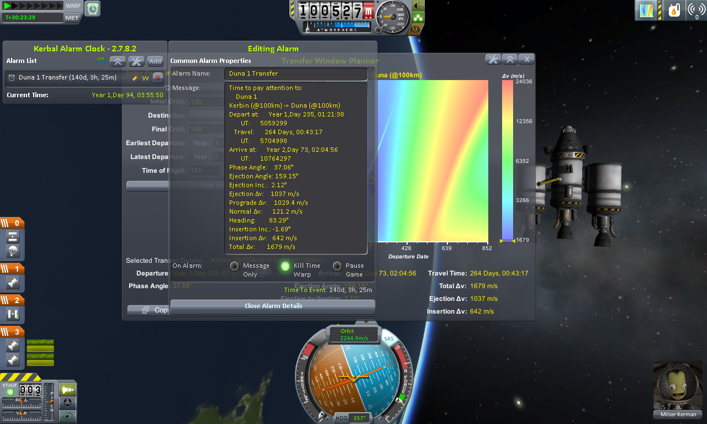
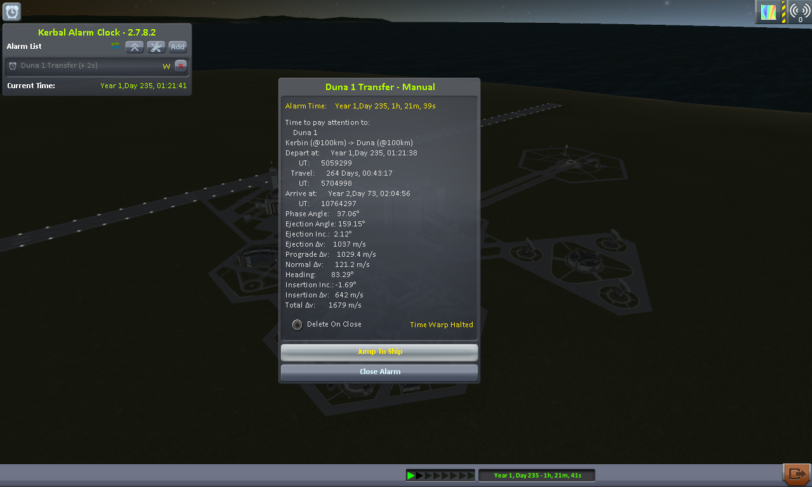
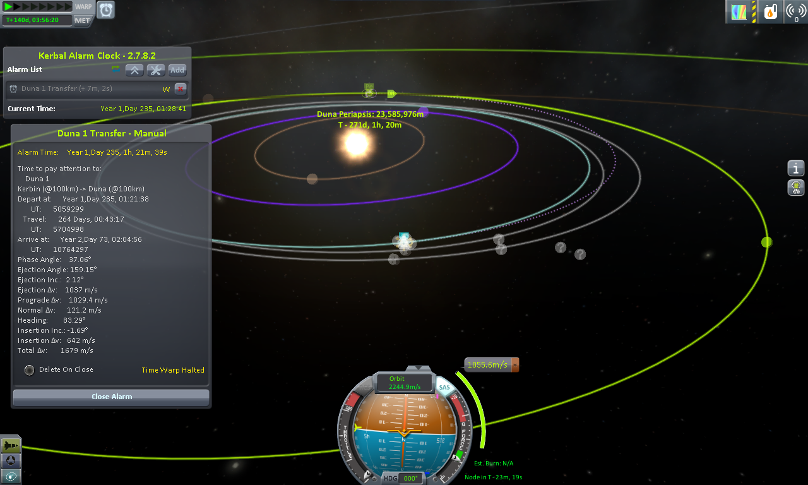

# Transfer Window Planner /L Unleashed

An ingame implementation of [AluxMun's Launch Window Planner WebApp](http://alexmoon.github.io/ksp/).

[Unleashed](https://ksp.lisias.net/add-ons-unleashed/) fork by Lisias.

## In a Hurry

* [Latest Release](https://github.com/net-lisias-kspu/TransferWindowPlanner/releases)
	+ [Binaries](https://github.com/net-lisias-kspu/TransferWindowPlanner/tree/Archive)
* [Source](https://github.com/net-lisias-kspu/TransferWindowPlanner)
* Documentation
	+ [Project's README](https://github.com/net-lisias-kspu/TransferWindowPlanner/blob/master/README.md)
	+ [Install Instructions](https://github.com/net-lisias-kspu/TransferWindowPlanner/blob/master/INSTALL.md)
	+ [Change Log](./CHANGE_LOG.md)
	+ [TODO](./TODO.md) list

## Description

The Transfer Window Planner is a plugin to let you visualise planetary transfer efficiency in-game. Using it you can select your planet of Origin and planet of Destination and it will present you with details about the required Delta-V to travel from Origin to Destination.

You access the tool by clicking on the Porkchop icon in either the AppLauncher or Common Toolbar - your choice - then follow the instructions in the main window. Once you have selected a transfer you can use the Copy buttons to copy that text to any other plugin or window.

Documentation can be found in the manual below with a range of pics, but heres a pic of the main screen:

### What does it do?

Simply put it provides data visualisations of the Δv required for planetary transfers. Hopefully the porkchop plot will help you to find an efficient time/burn to reach your destination.

Once you open up the Tool using the AppLauncher of integrated toolbar you select the Origin and Destination for your interplanetary transfer. Review and change any timings you want and Click "Plot".

Once the porkchop is plotted it gives you a visualisation of how much Delta-V is required to transfer a vessel from the origin to the destination and where the "sweet spot" is. By clicking on the plot it will show you all the important details about the transfer thats selected and give you the capability to copy these to the clipboard.

## Further References

* [AluxMun's Launch Window Planner WebApp](http://alexmoon.github.io/ksp/)
* [Interactive illustrated interplanetary guide and calculator for KSP](https://ksp.olex.biz)
* [Interplanetary transfer guide](https://www.reddit.com/r/KerbalSpaceProgram/comments/zieahe/interplanetary_transfer_guide/)

## Installation

Detailed installation instructions are now on its own file (see the [In a Hurry](#in-a-hurry) section) and on the distribution file.

## License:

<License description>

Please note the copyrights and trademarks in [NOTICE](./NOTICE).

## Acknowledgments

* A big thanks to Alexmun for his WebApp that does this and his providing of a lot of the maths code involved
* Also thanks to NathanKell for his persistence in explaining Real Solar System to me so I could test with it

## UPSTREAM

* [TriggerAu](https://forum.kerbalspaceprogram.com/profile/57838-triggerau/) ROOT
	+ [Forum](https://forum.kerbalspaceprogram.com/topic/84005-*/)
	+ [SpaceDock](https://spacedock.info/mod/713/Transfer%20Window%20Planner)
	+ [Github](https://github.com/TriggerAu/TransferWindowPlanner)
		- [Github Pages](http://triggerau.github.io/TransferWindowPlanner/)
